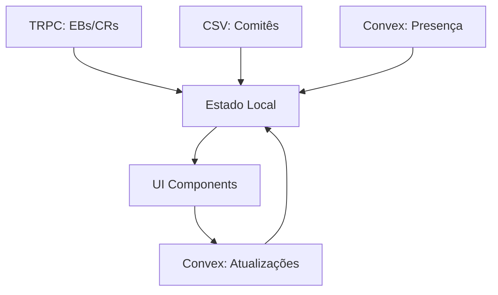

# 📋 Chamada AG - Documentation Técnica Completa

## 🎯 Visão Geral

A **Chamada AG** é um sistema completo de controle de presença para Assembleias Gerais da IFMSA Brazil. O sistema permite gerenciar três tipos diferentes de sessões de presença, cada uma com suas particularidades e regras específicas.

---

## 🏛️ Tipos de Sessão

### 1. 📊 **Plenária**
- **Propósito**: Sessões plenárias oficiais de uma assembleia específica
- **Participantes**: EBs, CRs e Comitês Locais (com status Pleno/Não-pleno)
- **Fonte de Dados**: Dados de `agParticipants` (baseado em CSV + registros de assembleia)
- **Cálculo de Quórum**: Diferenciado por categoria (EB: 50%, CR: 50%, Plenos: 50%, Não-plenos: 50%)
- **Persistência**: Dados salvos permanentemente no banco

### 2. 🏢 **Sessão**
- **Propósito**: Sessões específicas de uma assembleia (administrativas, workshops, etc.)
- **Participantes**: Baseado em `agRegistrations` (inscrições individuais)
- **Fonte de Dados**: Participantes que se registraram para a sessão específica
- **Cálculo de Quórum**: Por participantes individuais
- **Persistência**: Dados salvos permanentemente no banco

### 3. 📝 **Avulsa**
- **Propósito**: Chamadas gerais independentes de assembleia específica
- **Participantes**: Todos os EBs, CRs e Comitês (baseado em CSV)
- **Fonte de Dados**: Combinação de TRPC (EBs/CRs) + CSV (Comitês)
- **Cálculo de Quórum**: Geral por categoria
- **Persistência**: Dados temporários (não vinculados a assembleia)

---

## 🗂️ Arquitetura de Dados

### Fontes de Dados

#### **TRPC (Dados Estáticos)**
```typescript
// EBs (Executive Board)
ebData: {
  id: number,
  name: string,
  role: string
}[]

// CRs (Coordenadores Regionais)  
crData: {
  id: number,
  name: string,
  role: string
}[]
```

#### **CSV (Comitês Locais)**
```csv
Nome,Escola,Regional,Cidade,UF,Status,AG_Filiacao
"Comitê ABC","Universidade XYZ","Sudeste","São Paulo","SP","Pleno","AG123"
```

#### **Convex (Dados de Presença)**
```typescript
// Tabela: attendance
{
  type: "eb" | "cr" | "comite",
  memberId: string,
  name: string,
  role?: string,
  attendance: "present" | "absent" | "excluded" | "not-counting",
  status?: string, // Para comitês: "Pleno" | "Não-pleno"
  lastUpdatedBy: string,
  // Dados extras para comitês
  escola?: string,
  regional?: string,
  cidade?: string,
  uf?: string,
  agFiliacao?: string
}
```

### Fluxo de Dados



---

## 🎮 Interface do Usuário

### Seções Principais

#### **1. Cabeçalho de Ações**
- **Nova Chamada**: Modal para criar sessões (Plenária/Sessão/Avulsa)
- **Baixar Relatório**: Export Excel com presenças por categoria
- **Baixar QR Codes**: ZIP com QR codes individuais para todos os participantes
- **Leitores de QRs**: Gerenciamento de dispositivos móveis para leitura
- **Resetar Presenças**: Reset all attendance to "not-counting"

#### **2. Painel de Sessão Ativa** (se houver)
- Nome e tipo da sessão
- Estatísticas de presença
- Leitores QR específicos da sessão
- Botão para finalizar sessão

#### **3. Gerenciador de Presença Manual**
- **SessionAttendanceManager**: Interface para sessões (Plenária/Sessão)
- **Lista Manual**: Para chamadas avulsas

#### **4. Relatório Flutuante**
- Painel expansível no canto direito
- Estatísticas em tempo real por categoria
- Percentual de quórum calculado

---

## ⚙️ Estados de Presença

### Tipos de Estado
```typescript
type AttendanceState = "present" | "absent" | "excluded" | "not-counting";
```

### Comportamento dos Estados
- **🟢 Present**: Pessoa presente (conta para quórum)
- **🔴 Absent**: Pessoa ausente (não conta para quórum)
- **🟠 Excluded**: Pessoa excluída do quórum (não conta para cálculo)
- **⚪ Not-counting**: Estado padrão (não contabilizado)

### Ciclo de Estados
```
not-counting → present → absent → excluded → not-counting
```

### Interface dos Botões
- **CheckCircle** (Verde): Present
- **XCircle** (Vermelho): Absent
- **XCircle** (Laranja): Excluded  
- **Minus** (Cinza): Not-counting

---

## 📊 Cálculo de Quórum

### Fórmulas
```typescript
const QUORUM_REQUIREMENTS = {
  eb: 0.5,           // 50% dos EBs
  cr: 0.5,           // 50% dos CRs
  comitesPlenos: 0.5,    // 50% dos Comitês Plenos
  comitesNaoPlenos: 0.5, // 50% dos Comitês Não-Plenos
};

// Cálculo
const eligibleForQuorum = total - excluded;
const quorumPercentage = (present / eligibleForQuorum) * 100;
```

### Categorias de Contagem
- **Total**: Número total de membros
- **Present**: Membros marcados como presentes
- **Absent**: Membros marcados como ausentes
- **Excluded**: Membros excluídos do cálculo
- **Not-counting**: Membros não contabilizados

---

## 📱 Sistema de QR Codes

### Tipos de Leitores

#### **1. Leitores Globais**
- Funcionam para qualquer chamada avulsa
- Persistem entre sessões
- Gerenciados na seção "Leitores de QRs"

#### **2. Leitores de Sessão**
- Específicos para uma sessão ativa
- Removidos automaticamente ao finalizar sessão
- Criados no painel da sessão ativa

### Estrutura do QR Code
```json
{
  "type": "eb" | "cr" | "comite",
  "id": "member_id",
  "name": "Member Name",
  "role": "Member Role", // Para EBs/CRs
  "status": "Pleno" | "Não-pleno", // Para comitês
  "uf": "Estado" // Para comitês
}
```

### URLs dos Leitores
```
https://domain.com/leitor-qr/{token}
```

---

## 📄 Sistema de Relatórios

### Relatório Excel
- **4 Planilhas Separadas**:
  - Diretoria Executiva
  - Coordenadores Regionais  
  - Comitês Plenos
  - Comitês Não-Plenos

### Estrutura do Relatório
```typescript
// EB/CR
{
  'Tipo': 'EB' | 'CR',
  'Nome': string,
  'Cargo': string,
  'Status': 'Presente' | 'Ausente' | 'Excluído do quórum' | 'Não contabilizado'
}

// Comitês
{
  'Tipo': 'Comitê Pleno' | 'Comitê Não-Pleno',
  'Nome': string,
  'Escola': string,
  'Regional': string,
  'Localização': 'Cidade, UF',
  'Status': 'Presente' | 'Ausente' | 'Excluído do quórum' | 'Não contabilizado'
}
```

---

## 🔄 Fluxos de Operação

### Criação de Nova Chamada

#### **Chamada Avulsa**
1. User clica "Nova Chamada" → "Avulsa"
2. Sistema limpa attendance table
3. Carrega CSV de comitês
4. Carrega EBs/CRs via TRPC
5. Bulk insert todos com status "not-counting"
6. Interface atualiza com dados carregados

#### **Plenária/Sessão**
1. User seleciona assembleia
2. User define nome da sessão
3. Sistema cria sessão no banco
4. Sistema inicializa attendance baseado em agParticipants/agRegistrations
5. Interface muda para SessionAttendanceManager

### Atualização de Presença

#### **Manual**
1. User clica botão de presença
2. Estado avança no ciclo (not-counting → present → absent → excluded)
3. Sistema atualiza Convex
4. useEffect atualiza interface

#### **QR Code**
1. Dispositivo móvel escaneia QR
2. Sistema identifica participante
3. Presença é marcada automaticamente
4. Interface atualiza em tempo real

### Reset de Presenças
1. Sistema verifica se todos têm registros Convex
2. Cria registros faltantes se necessário
3. Reseta todos os status para "not-counting"
4. Interface atualiza via useEffect

---

## 🏗️ Implementação Técnica

### Componentes Principais

#### **ChamadaAGPage** (Main Component)
- Gerencia estado global
- Controla tipo de chamada ativa
- Renderiza interface baseado no contexto

#### **SessionAttendanceManager**
- Interface específica para Plenárias/Sessões
- Carrega participantes via agParticipants/agRegistrations
- Gerencia presença por sessão

### Hooks Principais

#### **useEffect Dependencies**
```typescript
// Rebuild EBs from Convex + TRPC
useEffect(() => {}, [ebsAttendance, ebData]);

// Rebuild CRs from Convex + TRPC  
useEffect(() => {}, [crsAttendance, crData]);

// Rebuild Comitês from Convex only
useEffect(() => {}, [comitesAttendance]);
```

### Mutations Principais
```typescript
// Attendance management
updateAttendance()      // Single attendance update
resetAttendanceOnly()   // Reset all to not-counting
bulkInsertAttendance()  // Bulk insert for new sessions
clearAllAttendance()    // Clear entire table

// Session management  
createSession()         // Create new session
archiveSession()        // Archive session
markSessionAttendance() // Update session-specific attendance

// QR Reader management
createQrReader()        // Create global reader
createSessionQrReader() // Create session-specific reader
removeQrReader()        // Delete reader
```

---

## 🐛 Problemas Conhecidos e Soluções

### **1. Status Corruption Bug**
**Problema**: Campo `status` dos comitês é sobrescrito por attendance states
**Solução**: Reconstrução de status via `agFiliacao` como fallback

### **2. Dual Data Source Conflict**  
**Problema**: TRPC carrega defaults, Convex sobrescreve
**Solução**: Convex sempre como source of truth

### **3. Reset Function Limited Scope**
**Problema**: Reset só afeta registros existentes no Convex
**Solução**: Criar registros faltantes antes de resetar

### **4. CSV Column Misalignment**
**Problema**: Status pode estar na coluna errada do CSV
**Solução**: Debug logging para identificar estrutura correta

---

## 🎛️ Configurações e Variáveis

### Environment Variables
```env
# CSV URL for committee data
REGISTROS_CSV_URL=https://...
```

### Quorum Requirements
```typescript
const QUORUM_REQUIREMENTS = {
  eb: 0.5,
  cr: 0.5, 
  comitesPlenos: 0.5,
  comitesNaoPlenos: 0.5,
} as const;
```

### Default States
```typescript
// Default attendance state for all new records
const DEFAULT_ATTENDANCE: AttendanceState = "not-counting";
```

---

## 🔧 Debugging e Troubleshooting

### Debug Logging Locations
1. **CSV Processing**: Console logs during committee parsing
2. **Convex Reconstruction**: Logs during status detection
3. **Attendance Updates**: Toast notifications for user feedback
4. **Reset Operations**: Console logs with counts and expectations

### Common Issues

#### **Comitês não aparecem**
- Check CSV URL accessibility
- Verify column structure in CSV
- Check Convex attendance table population

#### **Status errados (todos Não-pleno)**  
- Check column[5] in CSV contains status
- Verify status text parsing logic
- Check for status corruption in Convex

#### **Reset não funciona para todos**
- Verify all people have Convex records
- Check if reset is creating missing records first
- Confirm attendance table structure

### Performance Considerations
- **Bulk Operations**: Use `bulkInsertAttendance` for large datasets
- **useEffect Optimization**: Minimize unnecessary re-renders
- **Search Filtering**: Client-side filtering for responsive UX

---

## 📋 Checklist de Funcionamento

### ✅ **Chamada Avulsa deve**:
- [ ] Carregar ~21 EBs via TRPC
- [ ] Carregar ~12 CRs via TRPC  
- [ ] Carregar ~234 comitês via CSV
- [ ] Separar corretamente Plenos (~162) e Não-plenos (~72)
- [ ] Permitir alteração manual de presença
- [ ] Calcular quórum por categoria
- [ ] Gerar relatório Excel com 4 planilhas
- [ ] Reset funcionar para todos os ~267 participantes

### ✅ **Plenária deve**:
- [ ] Carregar participantes via agParticipants
- [ ] Manter status Pleno/Não-pleno corretos
- [ ] Salvar dados permanentemente
- [ ] Permitir leitores QR específicos da sessão

### ✅ **Sessão deve**:
- [ ] Carregar participantes via agRegistrations
- [ ] Gerenciar presenças individuais
- [ ] Salvar dados permanentemente

### ✅ **QR Codes devem**:
- [ ] Gerar arquivos PNG únicos para cada participante
- [ ] Funcionar com leitores globais e de sessão
- [ ] Atualizar presença automaticamente quando escaneados

---

## 🚀 Roadmap de Melhorias

### **Curto Prazo**
- [ ] Fix CSV column detection automática
- [ ] Resolver status corruption definitivamente
- [ ] Implementar reset inteligente

### **Médio Prazo**  
- [ ] Interface mais intuitiva para mudança de presença
- [ ] Relatórios em tempo real mais detalhados
- [ ] Backup automático de dados de sessão

### **Longo Prazo**
- [ ] API para integração com outros sistemas
- [ ] Dashboard analytics de participação
- [ ] Histórico de sessões e comparativos

---

*Documentação gerada para Chamada AG v1.0 - IFMSA Brazil* 