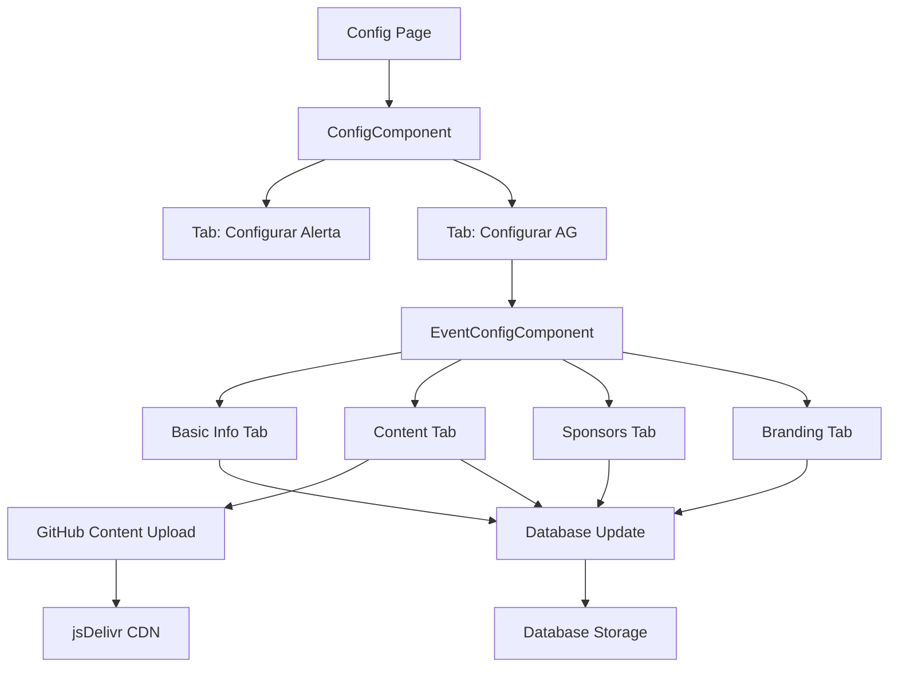

# Event Configuration System

## Overview

The Event Configuration System is a comprehensive solution for managing different types of events on the IFMSA Brazil website. It extends the existing configuration system to support both legacy alerts and full event management for Assembleia Geral (AG) events.

## Features

### 🎯 **Dual Configuration Modes**
- **Configurar Alerta**: Legacy alert/notification system
- **Configurar AG**: Full event configuration for Assembleia Geral events

### 📋 **Event Configuration Components**

#### 1. **Basic Information**
- Event type selection (Alert vs AG)
- Event activation toggle
- Event number (e.g., 63 for 63ª AG)
- Event title and description
- Date and location configuration
- Download links management (survival kit, registration)

#### 2. **Content Management**
- Rich markdown content editor
- Optional GitHub storage integration
- SEO metadata configuration
- Meta titles, descriptions, and keywords

#### 3. **Sponsor Management**
- Dynamic sponsor addition/removal
- Sponsor details (name, logo, tier, contact)
- Show/hide sponsors section toggle

#### 4. **Visual Branding**
- Primary and secondary color customization
- Event logo configuration
- Color preview functionality
- Event status management
- Registration status control

## Database Schema

### Extended Config Model
```sql
-- Event configuration fields added to existing Config table
eventType           String?         -- "alert" or "ag" 
eventActive         Boolean?        -- Whether event is currently active
eventNumber         Int?            -- Event number (e.g., 63 for 63ª AG)
eventTitle          String?         -- Full event title
eventDescription    String?         -- Event description/promotional text
eventLogo           String?         -- Path to event logo

-- Event dates and location
eventDateStart      DateTime?       -- Event start date
eventDateEnd        DateTime?       -- Event end date
eventCity           String?         -- Event city
eventState          String?         -- Event state
eventVenue          String?         -- Event venue name
eventAddress        String?         -- Full venue address

-- Event downloads and links
survivalKitUrl      String?         -- URL to survival kit PDF
registrationUrl     String?         -- URL to registration PDF
survivalKitStatus   String?         -- "available", "coming_soon", "disabled"
registrationStatus  String?         -- "available", "coming_soon", "disabled"

-- Event content
eventContent        String?         -- Markdown content for detailed info
eventContentUrl     String?         -- GitHub URL for content if using external storage

-- Event sponsors (JSON array)
eventSponsors       String?         -- JSON array of sponsor objects

-- Event branding
primaryColor        String?         -- Primary brand color
secondaryColor      String?         -- Secondary brand color

-- SEO and metadata
metaTitle           String?         -- Page title for SEO
metaDescription     String?         -- Meta description
metaKeywords        String?         -- SEO keywords

-- Configuration flags
showSponsors        Boolean?        -- Show/hide sponsors section
showDownloads       Boolean?        -- Show/hide download buttons
eventStatus         String?         -- "upcoming", "ongoing", "past"
registrationOpen    Boolean?        -- Whether registration is open

-- Tracking
lastUpdated         DateTime?       -- Auto-updated timestamp
updatedBy           String?         -- User ID who last updated
```

## API Endpoints

### TRPC Router: `config`

#### `config.getEvent`
- **Type**: Query
- **Description**: Get current event configuration
- **Returns**: Single event configuration with default values if none exists

#### `config.updateEvent`
- **Type**: Mutation
- **Input**: 
  ```typescript
  {
    id: number;
    eventConfig: EventConfigSchema;
    uploadContent?: boolean; // Upload content to GitHub
  }
  ```
- **Description**: Update event configuration with optional GitHub content upload

#### `config.getEventWithDetails`
- **Type**: Query
- **Description**: Get event configuration with parsed sponsor data
- **Returns**: Event configuration with sponsors as parsed array

#### `config.switchEventType`
- **Type**: Mutation
- **Input**: `{ eventType: "alert" | "ag" }`
- **Description**: Switch between alert and AG event configuration modes

## File Structure

```
src/
├── app/
│   ├── _components/
│   │   ├── ConfigComponent.tsx          # Main config component with tabs
│   │   └── EventConfigComponent.tsx     # Event-specific configuration
│   └── config/
│       └── page.tsx                     # Config page entry point
├── server/
│   └── api/
│       └── routers/
│           └── configRouter.ts          # Extended config router
└── prisma/
    ├── schema.prisma                    # Database schema
    └── migrations/
        └── 20250703164851_add_event_config/
            └── migration.sql            # Event config migration
```

## Components

### `ConfigComponent.tsx`
Main configuration component with tab navigation:
- **Configurar Alerta**: Legacy alert configuration
- **Configurar AG**: New event configuration

### `EventConfigComponent.tsx`
Comprehensive event configuration interface with:
- **Basic Tab**: Event info, dates, location, downloads
- **Content Tab**: Markdown content, SEO metadata
- **Sponsors Tab**: Dynamic sponsor management
- **Branding Tab**: Colors, logos, status settings

## GitHub Integration

### Content Storage
- Event content can be optionally stored in GitHub
- Follows patterns from `fileRouter.ts` and `noticias.ts`
- Automatic versioning and CDN delivery via jsDelivr
- Repository: `ifmsabrazil/dataifmsabrazil`
- Storage path: `/events/{eventType}-config.md`

### Upload Process
1. Content is converted to base64
2. Checks for existing file and retrieves SHA
3. Creates/updates file via GitHub API
4. Returns CDN URL for content access

## Usage Guide

### 1. **Setting Up a New AG Event**
1. Navigate to `/config`
2. Select "Configurar AG" tab
3. Fill in basic information:
   - Event number (e.g., 64)
   - Event title (e.g., "64ª Assembleia Geral")
   - Description and dates
   - Location details

### 2. **Managing Downloads**
1. Go to "Informações Básicas" tab
2. Enable "Mostrar Downloads"
3. Configure survival kit and registration URLs
4. Set status ("Em Breve", "Disponível", "Desabilitado")

### 3. **Adding Content**
1. Switch to "Conteúdo" tab
2. Write markdown content in the editor
3. Optionally enable "Salvar no GitHub" for external storage
4. Configure SEO metadata

### 4. **Managing Sponsors**
1. Go to "Patrocinadores" tab
2. Enable "Mostrar Seção"
3. Click "Adicionar" to add new sponsors
4. Fill in sponsor details (name, logo, tier, contact)

### 5. **Customizing Branding**
1. Switch to "Visual" tab
2. Set primary and secondary colors
3. Upload event logo
4. Configure event status and registration settings

## Data Flow



## Event Data Structure

### Sponsor Object
```typescript
interface Sponsor {
  name: string;
  logo?: string;
  tier?: string;           // "Patrocinador Diamante", "Parceiro Ouro"
  email?: string;
  acronym?: string;        // "MS", "CFM"
  website?: string;
}
```

### Event Configuration
```typescript
interface EventConfig {
  eventType: "alert" | "ag";
  eventActive: boolean;
  eventNumber?: number;
  eventTitle: string;
  eventDescription: string;
  eventLogo?: string;
  eventDateStart?: Date;
  eventDateEnd?: Date;
  eventCity?: string;
  eventState?: string;
  eventVenue?: string;
  eventAddress?: string;
  survivalKitUrl?: string;
  registrationUrl?: string;
  survivalKitStatus: "available" | "coming_soon" | "disabled";
  registrationStatus: "available" | "coming_soon" | "disabled";
  eventContent?: string;
  eventSponsors: Sponsor[];
  primaryColor: string;
  secondaryColor: string;
  metaTitle?: string;
  metaDescription?: string;
  metaKeywords?: string;
  showSponsors: boolean;
  showDownloads: boolean;
  eventStatus: "upcoming" | "ongoing" | "past";
  registrationOpen: boolean;
}
```

## Error Handling

- **Database errors**: Graceful fallback with toast notifications
- **GitHub upload failures**: Continues with local storage, logs errors
- **Validation errors**: Real-time form validation with user feedback
- **Network issues**: Retry mechanisms and user notifications

## Security

- **Authentication**: Requires IFMSA email authentication
- **Authorization**: Uses `ifmsaEmailProcedure` for all mutations
- **Input validation**: Comprehensive Zod schema validation
- **GitHub token**: Securely stored server-side in environment variables (`GITHUB_TOKEN`)

## Future Enhancements

### Planned Features
- [ ] Image upload for event logos
- [ ] Template system for different event types
- [ ] Multi-language content support
- [ ] Event analytics and metrics
- [ ] Integration with registration system
- [ ] Email notification system
- [ ] Social media integration

### Potential Improvements
- [ ] Real-time collaborative editing
- [ ] Version history for event configurations
- [ ] A/B testing for event pages
- [ ] Advanced sponsor management
- [ ] Custom event themes
- [ ] Integration with external calendar systems

## Troubleshooting

### Common Issues

**1. Configuration not saving**
- Check network connection
- Verify IFMSA email authentication
- Check browser console for errors

**2. GitHub content upload failing**
- Verify `GITHUB_TOKEN` environment variable (server-side)
- Check GitHub repository permissions
- Ensure repository exists and is accessible

**3. Sponsors not displaying**
- Verify JSON format in database
- Check if "Mostrar Seção" is enabled
- Validate sponsor data structure

**4. Colors not applying**
- Check color format (should be hex values)
- Verify CSS custom property support
- Clear browser cache

### Debug Steps
1. Check browser developer tools for console errors
2. Verify database connection and schema
3. Test TRPC endpoints individually
4. Check environment variables
5. Validate input data formats

## Contributing

When extending this system:

1. **Follow existing patterns**: Use similar structure to `fileRouter.ts` and `noticias.ts`
2. **Maintain type safety**: Add proper TypeScript interfaces
3. **Update documentation**: Keep this file current with changes
4. **Test thoroughly**: Test all configuration scenarios
5. **Consider backward compatibility**: Don't break existing alert functionality

## Support

For technical support or questions about this system:
- Check the troubleshooting section above
- Review the codebase documentation
- Contact the development team
- Submit issues via the project repository

---

**Last Updated**: January 2025  
**Version**: 1.0.0  
**Author**: IFMSA Brazil Development Team 